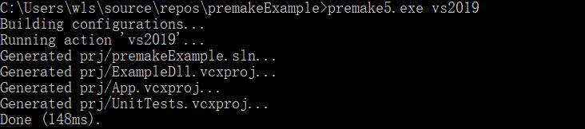
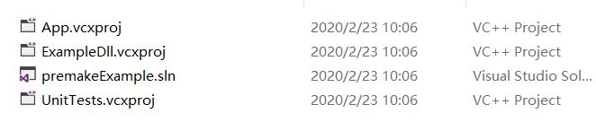
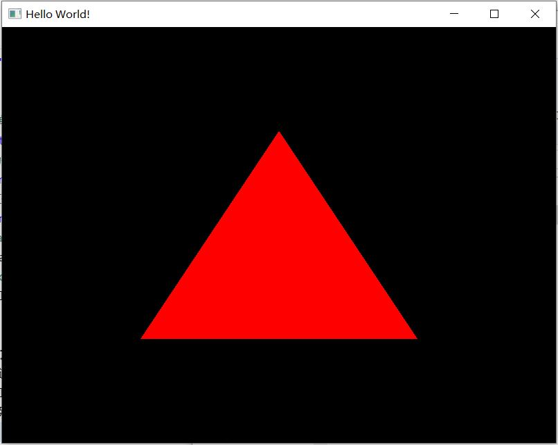
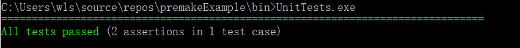

# premakeExample
## 1 简介
本文讲解如何基于premake5创建一个典型的C++解决方案，该解决方案包含三个项目：
- 一个依赖GLFW动态库的动态库项目ExampleDll
- 一个依赖ExampleDll动态库的窗口程序APP
- 一个基于Catch的单元测试程序UnitTest

## 2 你需要准备
- premake5.exe程序
- 一个文本编辑器
- 一个支持C++11的编译器，因为源代码使用了C++11特性
- 一个支持OpenGL 1.1的显卡

## 3 文件的组织结构
首先需要确定整个解决方案中源代码、三方库、二进制等文件的组织结构，本文创建的文件结构如下：
> premakeExample/  
> &emsp;|--premake5.lua （premake脚本文件） 
> &emsp;|--prj/ (生成的解决方案与各项目配置文件路径)  
> &emsp;|--build/   
> &emsp;|&emsp;|--target/ (目标生成路径)  
> &emsp;|&emsp;|--obj/ （中间文件生成路径）  
> &emsp;|--bin/ (最终发布的二进制文件路径)  
> &emsp;|--3rd/ (第三方库文件路径)  
> &emsp;|&emsp;|--Catch (Catch单元测试框架头文件路径)  
> &emsp;|&emsp;|--glfw （glfw三方库相关文件路径） 

## 4 下载所需文件
- premake5.exe [下载](https://github.com/premake/premake-core/releases "premake5.exe下载链接")
- glfw三方库 [下载](https://www.glfw.org/download.html "glfw下载路径")

> 本文以64位系统为例，需下载64位二进制库，也可以下载32位，但要记得在后面lua脚本中改变architecture配置。

> 将下载解压后的include和`lib-vc*`文件夹放在premakeExample/3rd/glfw文件夹下，`*`指代不同的vs版本，需与后续生成配置文件的vs版本一致。

> 将lib-vc*路径下的glfw3.dll拷贝纸premakeExample/bin路径下

- catch是一个只有头文件的依赖库，将Catch.hpp([下载](https://raw.githubusercontent.com/catchorg/Catch2/master/single_include/catch2/catch.hpp "catch.hpp下载路径"))放在premakeExample/3rd/Catch/include路径下即可。

## 5 添加代码
### 5.1 ExampleDll

ExampleDll库只是对glfw中的GLFWwindow进行了简单封装，隐藏了window的内部实现细节。Window类通过`_declspec(dllexport)`导出。

- ExampleDll.hpp代码如下：
```cpp
#ifndef EXAMPLE_DLL_HPP
#define EXAMPLE_DLL_HPP 1
#include <string>
#include <memory>
struct GLFWwindow;
namespace ExDLL
{	
	class _declspec(dllexport) Window
	{
	public:
		Window(int width, int  height, const std::string& title);
		~Window();
		bool shouldClose() const noexcept;
		void pollEvents() const noexcept;
		void swapBuffers() const noexcept;
		std::pair<int, int> getWindowSize() const noexcept;	
	private:
		GLFWwindow* wnd;
	};
}
#endif
```

- ExampleDll.cpp代码如下

```cpp
#include "ExampleDll.hpp"
#include <GLFW/glfw3.h>
	
namespace ExDLL
{
	Window::Window(int width, int height, const std::string& title)
	{
		glfwInit();
		wnd = glfwCreateWindow(width, height, title.c_str(), nullptr, nullptr);
		glfwMakeContextCurrent(wnd);
	}
	
	Window::~Window()
	{
		glfwDestroyWindow(wnd);
		glfwTerminate();
	}

	bool Window::shouldClose() const noexcept
	{
		return glfwWindowShouldClose(wnd) != 0;
	}

	void Window::pollEvents() const noexcept
	{
		glfwPollEvents();
	}

	void Window::swapBuffers() const noexcept
	{
		glfwSwapBuffers(wnd);
	}

	std::pair<int, int> Window::getWindowSize() const noexcept
	{
		std::pair<int, int> sz{};
		glfwGetWindowSize(wnd, &sz.first, &sz.second);
		return sz;
	}
}
```

### 5.2 App
应用程序依赖Exampledll，创建一个窗口应用程序，并运用固定管线绘制一个红色的三角形。当然本教程不讲解OpenGL，如果想要学习OpenGL的使用，应该学习更先进的可编程管线。
- main.cpp代码如下：

```cpp
#include <ExampleDll.hpp>

#if defined _WIN32
    //Windows平台使用OpenGL需要包含Windows.h
	#include <Windows.h>
	//消除窗口程序的控制台界面
	#pragma comment(linker,"/subsystem:\"windows\" /entry:\"mainCRTStartup\"")
#endif
#include <gl/GL.h>

//导入ExampleDll中的Window类
class _declspec(dllimport) ExDLL::Window;

int main()
{
	ExDLL::Window window{ 800, 600, "Hello World!" };
	while (!window.shouldClose())
	{
		window.pollEvents();
		//为简单起见，使用了古老的固定管线
		glColor3f(1.0, 0.0, 0.0);
		glBegin(GL_TRIANGLES);
			glVertex2f(-0.5f, -0.5f);
			glVertex2f(0.5f, -0.5f);
			glVertex2f(0, 0.5f);
		glEnd();
		window.swapBuffers();
	}
	return 0;
}
```

### 5.3 UnitTest
单元测试程序检查创建的窗口大小是否与参数要求的大小一致。
- Test.cpp代码如下：

```cpp
#define CATCH_CONFIG_MAIN
#include <Catch.hpp>

#include <ExampleDll.hpp>

TEST_CASE("Window tests", "[ExampleDll]")
{
	using namespace ExDLL;
	Window w{ 600, 400, "Test Window" };

	auto size = w.getWindowSize();

	REQUIRE(size.first == 600);
	REQUIRE(size.second == 400);
}
```


## 6 编写premake5.lua脚本文件
premake5.lua是生成工程配置文件的核心。

- premake5.lua代码如下：

```lua
-- 最终解决方案的名称
workspace "premakeExample"
	-- 解决方案与各项目配置文件生成路径
	location "prj"
	-- 指定语言
	language "C++"
	-- 指定架构 x64 或 x86 或  x86_64
	architecture "x64"
	-- 配置类型
	configurations {"Debug","Release"}
	-- 针对Debug配置类型的参数设置
	filter {"configurations:Debug"}
		symbols "On"
	-- 针对Release配置类型的参数设置
	filter {"configurations:Release"}
		optimize "On"
	-- 重置过滤器的其他设定
	filter {}
	-- 目标文件生成路径 如%{prj.name}为内置的宏，指项目的名称，如后面的ExampleDll，App等
	targetdir ("build/target/%{prj.name}/%{cfg.longname}")
	-- 中间文件生成路径
	objdir ("build/obj/%{prj.name}/%{cfg.longname}")
	-- 编译后命令行，将目标文件拷贝至bin文件夹，注意../bin/是prj文件夹的相对路径
	postbuildcommands{
		("{COPY} %{cfg.buildtarget.relpath} \"../bin/\"")
	}
	
-- 定义函数，包含glfw三方库头文件，可被其他工程调用
function includeGLFW()
	includedirs "3rd/glfw/include"
end
-- 定义函数，链接glfw三方库
function linkGLFW()
	-- 指定lib的文件路径
	libdirs "3rd/glfw/lib-vc2019"
	-- 指定lib文件名，即glfw3dll.lib，此处使用的是动态库
	links "glfw3dll"
end

-- ExampleDll项目
project "ExampleDll"
	-- 类型为动态库项目
	kind "SharedLib"
	-- 代码文件，即ExampleDll文件夹下的所有文件
	files "src/ExampleDll/**"
	-- 包含glfw头文件
	includeGLFW()
	-- 链接glfw三方库
	linkGLFW()

-- 定义函数，链接ExampleDll动态库
function useExampleDLL()
	includedirs "src/ExampleDll"
	links "ExampleDll"
end

-- App应用程序
project "App"
	-- 类型为控制台程序
	kind "ConsoleApp"
	-- 代码文件
	files "src/App/**"
	-- 链接ExampleDll动态库
	useExampleDLL()
	-- windows平台使用OpenGL需链接OpenGL32
	filter "system:windows"
		links {"OpenGL32"}

-- 定义函数，包含Catch
function includeCatch()
	includedirs "3rd/Catch/Include"
	-- 预定义宏，C++版本为C++11及以上
	defines "CATCH_CPP11_OR_GREATER"
end

-- UnitTests单元测试项目
project "UnitTests"
	-- 类型为控制台程序
	kind "ConsoleApp"
	-- 代码文件
	files "src/UnitTests/**"
	-- 包含Catch
	includeCatch()
	-- 链接ExamleDll
	useExampleDLL()
```

## 7 生成工程文件并编译
premake5.exe运行时时会寻找调用命令路径下的premake5.lua文件，如果想生成工程配置文件，需在premakeExample路径下调用`premake5.exe <action>`，其中`action`可指定为`vs2019`或`gmake`，本文以vs2019为例。

执行命令后在prj文件夹下，生成的工程配置文件如下：

打开premakeExample.sln编译解决方案，在bin路径下运行app.exe，效果如下：

命令行打开单元测试程序UnitTests.exe,效果如下：
